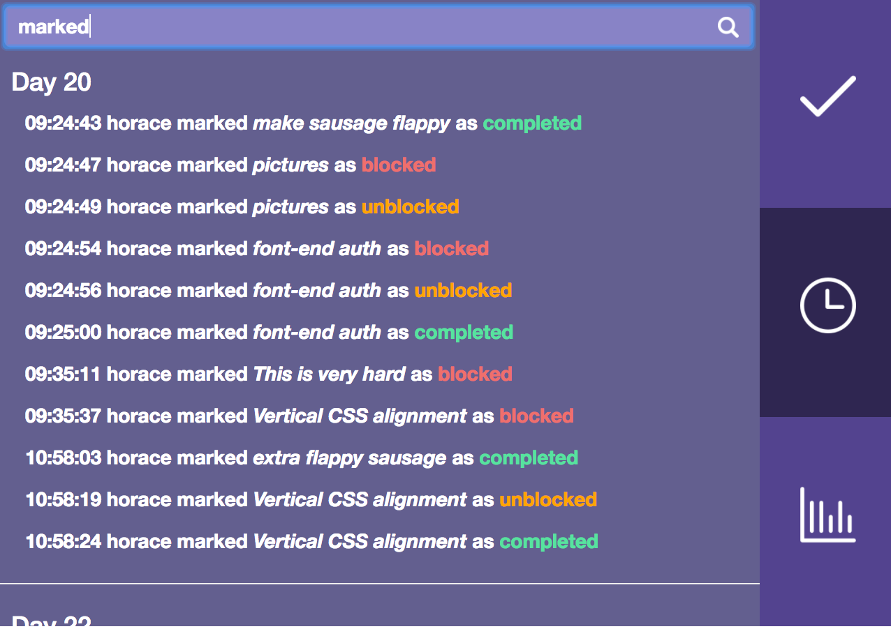

# Fck It Shp It
---

A collaboration between Harry Sterling, Maxim Kartuzov and Horace Keating

--

--
## What is it?

Fck It Shp It is a sprint management tool for developers who want a simple means of visualising the flow of a project. It allows users to quickly and easily track the amount of time left, the progress that has been made, and the main blockers for a project.


On registration the user is taken to their dashboard, where they can view any projects that they have created or been invited to collaborate on, as well as how long is left before each deadline.

On loading the view page for a project the first part of the screen shows a timeline of the project including any specific milestones that the project creator may have set.
Below this is the control panel where users can manage their tasks: you can view the tasks for a selected day, assign collaborators to specific tasks, mark tasks as blocked or completed with a simple drag-and-drop, and update their descriptions and colour-tags.
The right hand side of the control panel has three tabs: the blocked/completed tasks tab, the project log, and the stats page. By default the blocked tasks are shown, but you can also view all completed tasks instead if you need a little pick-me-up at the end of a hard day!
The project log records all actions taken by the collaborators on a project and is searchable, making it easier than ever to pinpoint who did what at 4pm last Tuesday.


Alongside the project log, the stats page gives detailed coverage of overall project statistics, as well as an individual breakdown for each collaborator:


--

## How is it built?

Fck It Ship It is built with Rails on the back-end and an AngularJS front-end. 

### Using this Angular Gulp Setup

To get setup with the starter-code, you first need to run:

```sh
$ bower install && gulp install
```

## How is gulp setup?

Rather than trying to manage one giant `gulpfile.js` that is file responsible for creating multiple tasks, each task has been broken out into its own file and placed in a directory `tasks`. Any files in that directory get automatically required in the gulpfile using the `require-dir` npm package.

To add a new task, simply add a new task file that directory.

/tasks/default.js specifies the default set of tasks to run
when you run `gulp`.

Configuration options are stored in the `package.json` file.

When deploying, ensure that a `postinstall` script has been added to
your package.json, e.g.

```json
"postinstall": "bower install && gulp deploy"
```

This setup expects that there is a bower.json file with at least ONE package
installed. This will created a bower_components directory after
the postinstall script has run.

When deploying, this setup expects that the NODE_ENV is set to `production`.
Also that the NPM_CONFIG_PRODUCTION is set to `false`. Then you can also set the API_URL to be the correct URL for your deployed app. This will automatically replace `http://localhost:4000` to be the correct url.

You can do this by running:

```bash
$ heroku config:set NODE_ENV=production
$ heroku config:set NPM_CONFIG_PRODUCTION=false

# An example url
$ heroku config:set API_URL=https://project-on-heroku.herokuapp.com/
```

### Bower overrides

Sometimes, you might want to `override` the `main` file(s) for a specific Bower component. You can do this directly inside the `bower.json` file like this:

```json
"overrides": {
  "bootstrap": {
    "main": [
      "dist/css/bootstrap.css",
      "dist/js/bootstrap.js",
      "dist/fonts/*"
    ]
  },
  "font-awesome": {
    "main": [
      "css/font-awesome.css",
      "fonts/*"
    ]
  }
},
```
